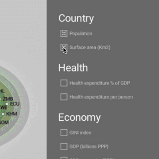
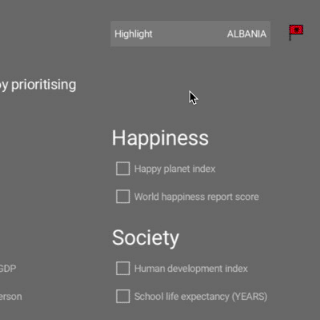
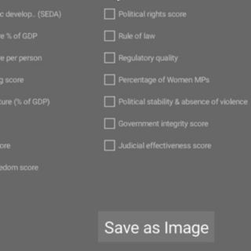
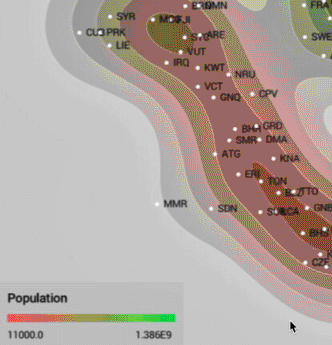
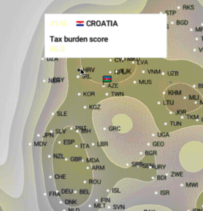

Tool to inspect the indicators that might make a good government.

In this tool, the countries will re-arrange according to inter-country similarity of the selected indicators. The indicators are grouped in 6 main categories (for example Health, Happiness, etc) with subcategories and can be coloured along 32 themes.

The closer countries are to each other, the more similarities. In order to be able to focus on factors that determine what might make a good government, the indicators Population size and Surface area can be deselected.
                     
macOS App :  [Download](https://github.com/BoydRotgans/goodgovernment/raw/master/dist/GoodGov.zip)

If you have trouble running the app, follow these [instructions](https://support.apple.com/kb/ph25088?locale=en_US).                     
                     

For generating the maps we used t-Distributed Stochastic Neighbor Embedding (t-SNE) algorithms. Special thanks go to lejon for his Barnes Hut Java implementation. 
https://github.com/lejon/T-SNE-Java

### Features

|   |   |   |
|---|---|---|
|  Prioritize |  Highlight |   Save to file     
|  Theme |  Hover  |

### Project

This project takes part in the World Data Visualization Prize
https://wdvp.worldgovernmentsummit.org/

Data provided by WDVP https://docs.google.com/spreadsheets/d/11LhOlwsloUuA495r-04IDwciMqNrLwWGpveqpF61WXU/edit#gid=0

